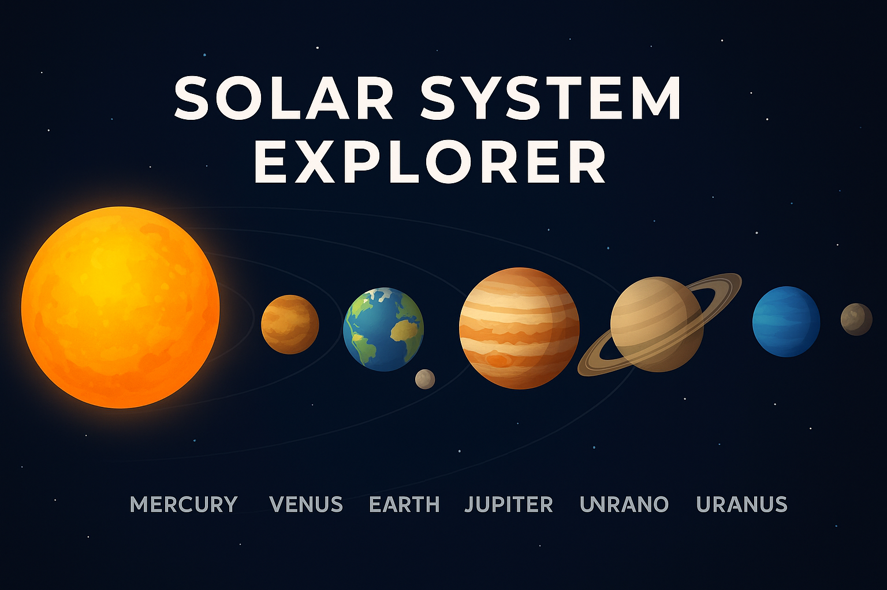

# 🌌 Interactive 3D Solar System



<p align="center">
   A simple yet visually engaging <b>3D Solar System</b> simulation built using only <b>HTML</b> and <b>CSS</b>.  
   Explore the orbits and rotations of planets in an elegant and interactive design — right in your browser.
</p>

---

## 🚀 Features

- 🪐 Pure **HTML + CSS** implementation (no JavaScript required)  
- 🌍 Smooth animations for planet orbits and rotations  
- 🌞 Central sun with orbiting planets for a realistic feel  
- 💻 Runs directly in the browser — lightweight and fast  
- 🎨 Clean and minimal design  

---

## 📂 Project Structure
Interactive-3-D-Solar-System/
│── index.html # Main entry point
│── style.css # Styling and animations
│── banner.png # Project banner for README
└── README.md # Project documentation


---

## ⚡ Getting Started

1. **Clone the repository**  
   ```bash
   git clone https://github.com/Devansh-Bansal-AI/Interactive-3-D-Solar-System.git

Open the project folder

cd Interactive-3-D-Solar-System


Launch the project

Simply open index.html in your browser

📸 Preview
<p align="center">  <br> <i>Experience a CSS-only Solar System simulation!</i> </p>
🤝 Contributing

Contributions are welcome! 🚀
Feel free to fork this repo, make improvements, and open a pull request.

📜 License

This project is licensed under the MIT License – free to use, modify, and distribute.

<p align="center"> Made with ❤️ by <b><a href="https://github.com/Devansh-Bansal-AI">Devansh Bansal</a></b> </p> ```
